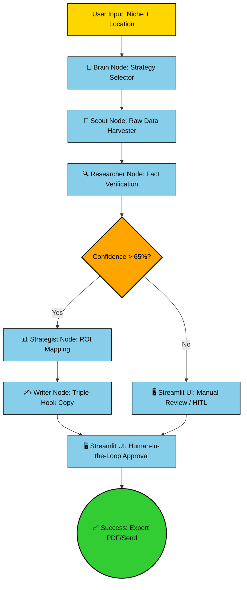

# 🎯 DFW Market-Intelligence Agent
### *Multi-Agent Prospecting Pipeline for the North Texas Market*

This project automates the journey from raw news to high-value sales outreach. Specifically designed for the **Dallas-Fort Worth metroplex** (Frisco, Plano, Southlake, etc.), it identifies expansion signals, calculates ROI, and drafts targeted outreach strategies using a stateful multi-agent architecture.

---

## 🚀 Architecture Overview
The system is structured as a **Directed Acyclic Graph (DAG)** orchestrating five specialized agents via **LangGraph**. This ensures a deterministic and reliable workflow compared to standard linear chains.

* **🧠 Brain Node** – Determines search strategy based on niche (e.g., Healthcare) and location.
* **📡 Scout Node** – Uses **Firecrawl** for live web scraping to gather real-time market data.
* **🔍 Researcher Node** – Filters raw text to detect verified growth signals (expansions, hiring surges, permits).
* **📊 Strategist Node** – Maps industry benchmarks to signals to compute potential ROI.
* **✍️ Writer Node** – Drafts "Triple-Hook" outreach emails with **Human-in-the-Loop** review.

### 🧩 Workflow Diagram



**Key Advantages:**
* **Stateful Workflow:** Ensures data consistency across asynchronous nodes.
* **Confidence Gating:** Prevents low-quality or hallucinated outputs (Signals <65% are flagged).
* **Enterprise-Ready:** PDF reporting and real-time log streaming for full observability.

---

## 🛠️ Tech Stack

| Layer | Technology |
| :--- | :--- |
| **Orchestration** | LangGraph |
| **LLM** | Google Gemini 2.5 Flash (via LangChain) |
| **Web Scraping** | Firecrawl API |
| **Frontend** | Streamlit (Human-in-the-Loop) |
| **Logic** | Python 3.10+, Pydantic |

---

## ✨ Key Features
* **Human-in-the-Loop (HITL) Editing:** Review AI-generated research and edit outreach drafts before sending.
* **Confidence Scoring:** Researcher assigns a confidence score; low-confidence signals are flagged for manual verification.
* **ROI-Driven Copy:** Strategist node injects numerical ROI insights into outreach based on market benchmarks.
* **PDF & Log Export:** Sanitized filename generation and real-time log streaming within the UI.
* **Session State Management:** Persistent Streamlit states ensure workflow continuity across reruns.

---

## 🚦 Getting Started

### 1. Clone Repository
```bash
git clone [https://github.com/your-username/dfw-market-intel.git](https://github.com/your-username/dfw-market-intel.git)
cd dfw-market-intel
```

### 2. Configure Environment
Create a `.env` file in the root directory:
```env
GOOGLE_API_KEY=your_gemini_key
FIRECRAWL_API_KEY=your_firecrawl_key
```

### 3. Install Dependencies & Run
```bash
pip install -r requirements.txt
streamlit run streamlit_app.py
```

---

## 📈 Why It Matters
This project demonstrates **AI Systems Engineering** over simple prompt engineering:

* **State Management:** Persisting complex data across multi-agent asynchronous workflows.
* **Defensive Design:** Safe JSON parsing and robust error handling for non-deterministic LLM outputs.
* **Regional Expertise:** Specifically tuned for the economic landscape of North Texas.
* **Cost Awareness:** Efficient multi-agent orchestration reduces tokens by isolating tasks to smaller, focused prompts.

---

## 📂 Project Structure

| File | Purpose |
| :--- | :--- |
| `agent.py` | Core LangGraph agent definition and node logic |
| `app.py` | Frontend UI and session state management |
| `prompts.py` | Version-controlled system instructions (v7.4) |
| `utils.py` | Helper functions: parsing, filename sanitization |

---

## 👨‍💻 Connect with the Developer

I am an entry-level **GenAI Engineer** focused on building stateful, multi-agent systems that solve real-world business bottlenecks. Based in the heart of the North Texas tech corridor, I specialize in bridging the gap between raw LLM capabilities and reliable enterprise workflows.

* **LinkedIn:** [linkedin.com/in/shirin-lakhani786](https://www.linkedin.com/in/shirin-lakhani786/)
* **GitHub:** [github.com/shirinlakhani](https://github.com/shirinlakhani)
* **Location:** 📍 Colleyville / Dallas-Fort Worth, TX / Remote

---
*Built with 🎯 in North Texas. Distributed under the MIT License.*
