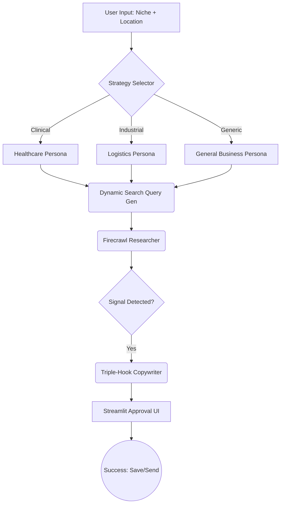

# Agentic Market-Intelligence & Outreach System (v1.0)
### *A Multi-Domain, Stateful Research & Personalization Engine*

An autonomous system designed to identify high-value business "signals" across the **Dallas-Fort Worth** market (Healthcare, Logistics, Real Estate, etc.). This engine uses a domain-agnostic agentic workflow to move beyond static prompt engineering into intelligent lead discovery and "Triple-Hook" copywriting.

## System Architecture
The system is built on **LangGraph** using a deterministic state machine to ensure reliability and 100% data persistence via SQLite checkpointing.


## Key Features

* **Signal-Based Discovery:** Leverages **Firecrawl** to monitor high-authority local sources (e.g., *Dallas Business Journal*, *Dallas Innovates*) and identify "Why Now" events—such as office expansions, hiring surges, or funding rounds—before they reach national aggregators.
* **Zero-Shot Signal Detection:** Utilizes **Gemini 1.5 Flash** to semantically analyze web data from **Firecrawl**. The system autonomously identifies "Why Now" events (expansion, hiring, M&A) based on business intent rather than brittle, hardcoded keyword matching.
* **Triple-Hook Copywriting:** Leverages **Gemini 1.5 Flash** to draft emails following the *Observation → Insight → Low-Friction Ask* framework.
* **Fault-Tolerant Persistence:** Integrated **SQLite Checkpointing** (via `SqliteSaver`) to maintain state across sessions, allowing for long-running human-in-the-loop (HITL) workflows.
* **Resource Efficient:** Optimized for **8GB Apple Silicon** memory constraints through sequential batching and externalized model inference.
* **Dynamic Strategy Engine:** Automatically pivots research logic, tone, and value propositions based on the target industry (e.g., HIPAA-focus for Healthcare vs. ROI-focus for Logistics).

## Tech Stack

* **Orchestration:** LangGraph (Python)
* **LLM:** Gemini 1.5 Flash (via Google AI Studio)
* **Search/Scraping:** Firecrawl (Markdown-optimized)
* **Database:** SQLite 3.0 (Local Persistence)
* **Interface:** Streamlit

## Strategic Domain Mapping

The system utilizes a **Dynamic Strategy Engine** to pivot research and outreach logic based on the target industry. This ensures the "Triple-Hook" remains relevant to specific DFW market sectors.

| Domain | Key Signal (Input) | Derived Pain Point | Proposed Solution (Output) |
| :--- | :--- | :--- | :--- |
| **Healthcare** | New Office / Hiring Surge | Administrative Burnout | **Patient Navigator Agent** |
| **Logistics** | Fleet Expansion / New Warehouse | Routing Inefficiency | **AI Dispatcher Assistant** |
| **Real Estate** | New Multi-family Development | Lead Response Lag | **24/7 Virtual AI Leasing** |

> **Note:** The "Key Signal" is discovered dynamically via the Researcher Agent; the "Derived Pain Point" is a logical inference generated by the Gemini 1.5 Flash reasoning engine.

### Human-in-the-Loop (HITL) Architecture
To ensure enterprise-grade reliability, the system implements a **Suspended State** pattern:
1. **Interrupt:** The LangGraph workflow automatically pauses after the Copywriter node.
2. **Review:** The state is persisted to SQLite, allowing the user to review the "Triple-Hook" draft via Streamlit.
3. **Resume/Feedback:** The user can approve, edit, or provide natural language feedback (e.g., "Make this shorter"), which triggers a recursive refinement loop before final execution.

### Observability & Traceability
* **State Inspection:** Every node transition and metadata change is logged with a unique `thread_id` for session recovery.
* **Trace-Ready:** The system is pre-configured for **LangSmith** integration. Simply add `LANGCHAIN_TRACING_V2=true` to your `.env` to visualize the entire Graph-of-Thought reasoning path.

### Design Trade-offs
* **Why Gemini 1.5 Flash?** Chosen for its massive 1M+ token context window (perfect for deep Firecrawl scrapes) and low latency on the Free Tier.
* **Why SQLite?** Provides zero-config, "edge-ready" persistence that runs locally on an 8GB M2 Mac without needing a heavy Dockerized Postgres instance.
* **Why Sequential Batching?** To prevent memory pressure on Apple Silicon while maintaining high throughput for lead research.

## Local Setup

1.  **Clone & Environment:**
    ```bash
    git clone [https://github.com/shirinlakhani/sales-outreach-agent.git](https://github.com/shirinlakhani/sales-outreach-agent.git)
    cd sales-outreach-agent
    python3 -m venv venv && source venv/bin/activate
    pip install -r requirements.txt
    ```

2.  **Configuration:** Create a `.env` file in the root directory to store your API keys safely:
    ```env
    GOOGLE_API_KEY=your_gemini_key_here
    FIRECRAWL_API_KEY=your_firecrawl_key_here
    ```

3.  **Run Dashboard:**
    ```bash
    streamlit run app.py
    ```
## Performance & Safety

* **Safety Gate:** 100% of outreach requires manual approval via the **Streamlit UI** before execution to ensure zero-hallucination communication.
* **Rate Limiting:** Built-in **5s backoff** logic to remain strictly within **Gemini 1.5 Flash Free Tier** constraints (15 RPM).
* **Audit Log:** All agent reasoning, lead scoring decisions, and metadata are logged locally to `outreach.db` for full transparency and debugging.